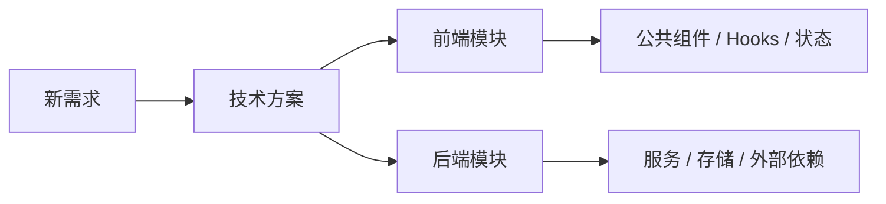
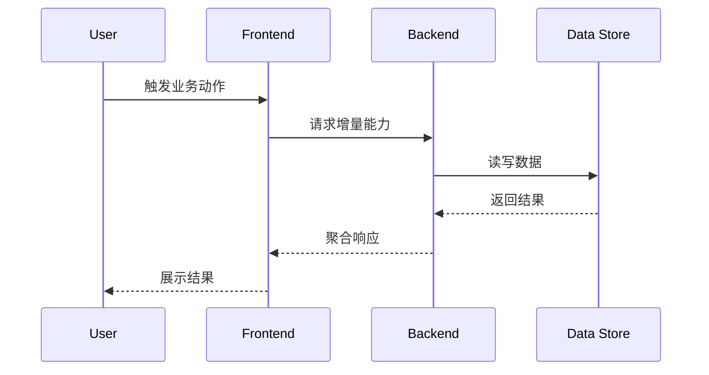

# 技术方案模板

按下面的结构输出技术方案，避免把“背景介绍”写成空泛概述。每一节都要绑定当前项目现状、增量需求和选型结论。

## 文档头部

- 需求来源
- 方案文件路径
- 基线方案
- 增量范围定义
- 中文需求简称（用于文件名）
- 关键假设
- 待确认问题

文件命名要求：

- 文件名固定为 `YYYY-MM-DD-[中文需求简称].md`
- `[中文需求简称]` 来自本次新增需求的简要中文名称
- 避免使用 `v1`、`最终版`、`新方案` 这类无业务语义的名称
- 优先让文件名一眼能看出本次新增需求是什么

## 1. 技术可行性分析

说明：

- 增量需求的核心目标
- 当前项目是否具备实现前提
- 主要技术风险和规避方式
- 如果项目缺少初始化能力，需要补什么基础设施

## 2. 技术选型

至少给出 3 个可行方案，并使用表格对比：

| 方案 | 学习成本 | 集成难度 | 技术生态 | 维护状态 | 热门程度 | 改造难度 | 适配当前项目的原因 |
| --- | --- | --- | --- | --- | --- | --- | --- |
| 方案 A |  |  |  |  |  |  |  |
| 方案 B |  |  |  |  |  |  |  |
| 方案 C |  |  |  |  |  |  |  |

然后补充：

- 最终选型结论
- 为什么不是另外两个方案
- 与现有项目规范、依赖、部署方式的适配点

## 3. 架构设计

至少覆盖：

- 模块拆分
- 前后端目录或服务边界
- 公共组件、公共逻辑、Hooks、状态管理、事件机制的抽取点
- 接口定义、数据流、权限或校验约束
- 改造清单和影响范围

### 3.0 当前完整架构快照

这一节不是简单复述历史文档，而是把“当前存量架构 + 本次增量设计”合并成一份精简快照，保证读者只看当前文档也能快速理解项目全貌。

至少覆盖：

- 当前系统的主要模块和职责
- 前后端或服务边界
- 本次需求落位到哪些现有模块、哪些新增模块
- 当前推荐的公共组件、公共逻辑、状态管理与共享层结构
- 哪些内容沿用存量方案，哪些内容是本次新增或调整

### 3.1 架构图

优先使用 Mermaid，例如：

### 3.2 流程示意图

描述关键数据流、调用链或状态流转，例如：

### 3.3 重难点功能详细技术设计

按功能块拆分，每个功能至少包含：

- 目标
- 设计思路
- 实现方式
- 是否需要公共组件或公共逻辑抽取
- 如有必要，给小段代码示例辅助说明

## 4. 影响范围

列出：

- 新增目录、文件、模块
- 需要改动的现有页面、组件、接口、服务、配置
- 需要回归验证的功能清单
- 对测试、发布、迁移的影响

## 交付前自检

- 是否明确了需求来源和增量范围
- 是否生成了可独立阅读的“当前完整架构快照”
- 是否引用了最新存量方案和当前代码现状
- 是否完成了 3 个方案以上的对比
- 是否给出了明确的最终选型理由
- 是否列清了模块拆分、公共抽取和改造清单
- 是否包含架构图、流程图和回归影响范围
- 是否在结尾明确“等待评审，不进入编码”
